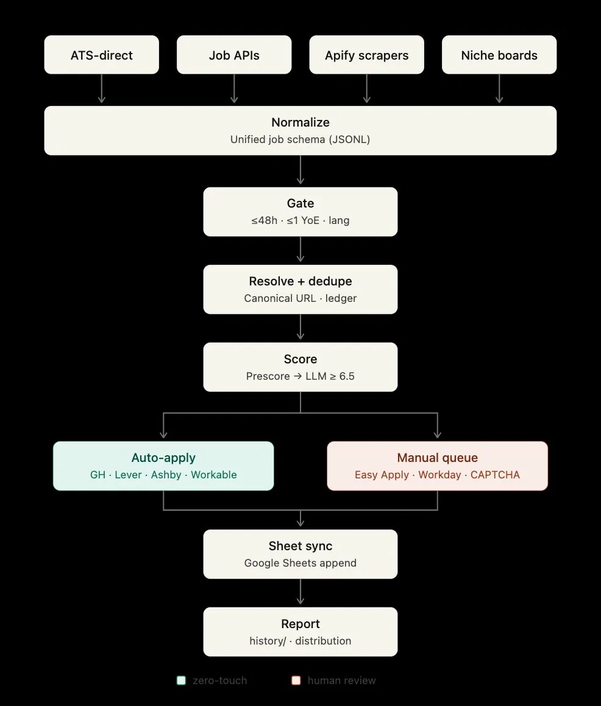

# JobPilot — autopilot for job applications

JobPilot is an open-source job-application pipeline for discovering fresh early-career Software Engineering and AI/ML roles, scoring them against your CV, auto-applying where it is safe and supported, and routing the rest into a manual review queue.

It is designed for candidates targeting **new grad**, **junior**, and **early-career** roles across:

**Germany · Netherlands · Ireland · United Kingdom · Turkey · worldwide remote**

The pipeline focuses on jobs posted within the last **48 hours**, filters out roles that are clearly above the candidate’s experience level, and keeps every decision traceable through a Google Sheet and session report.



---

## What it does

JobPilot turns scattered job sources into a structured application workflow:

```text
discover → normalize → gate → dedupe → score → apply/queue → sync → report
```

It collects jobs from multiple source types, normalizes them into a unified schema, filters them through candidate-specific gates, scores them with an LLM rubric, and then separates them into:

* **Auto-apply jobs** — supported ATS flows such as Greenhouse, Lever, Ashby, and Workable.
* **Manual queue jobs** — Workday, LinkedIn Easy Apply, CAPTCHA-protected flows, or anything requiring human judgment.

Everything is written back to a Google Sheet so the candidate has a clean ledger of discovered, skipped, queued, and applied roles.

---

## Pipeline overview

### 1. Discover

JobPilot can discover roles from:

* ATS-direct sources
* Job APIs
* Apify scrapers
* Niche job boards
* Remote-job boards
* Relocation and visa-sponsorship boards

ATS-direct sources are preferred because they usually provide cleaner metadata, real posting timestamps, and canonical application links.

---

### 2. Normalize

All incoming jobs are converted into a unified JSONL schema.

Each job is normalized into consistent fields such as:

* company
* title
* location
* remote policy
* seniority
* posting timestamp
* source URL
* canonical application URL
* ATS provider
* language requirements
* visa or relocation signals
* description text
* detected tech stack

---

### 3. Gate

Before scoring, JobPilot filters out jobs that clearly do not match the candidate profile.

Typical gates include:

* posted within the last **48 hours**
* maximum **0–1 years of experience**
* English-friendly or candidate-language-compatible
* no strict local citizenship requirement
* no unsupported local-only language requirement
* relevant to Software Engineering, Backend, Full-Stack, AI Engineering, or ML Engineering
* compatible with relocation, visa sponsorship, Turkey, or worldwide remote work

Jobs that fail hard requirements are skipped before any LLM scoring happens.

---

### 4. Resolve and dedupe

Scraped jobs are treated as discovery hints, not final truth.

JobPilot resolves each job to its canonical application URL whenever possible, then deduplicates roles across sources using:

* canonical ATS URL
* company name
* job title
* location
* posting date
* source ledger history

This prevents applying to the same role multiple times from different job boards.

---

### 5. Score

Each remaining job is scored against the candidate profile.

Scoring happens in two stages:

1. **Prescore** — fast rule-based filtering.
2. **LLM score** — detailed fit analysis.

The LLM score evaluates:

* role fit
* seniority fit
* tech-stack match
* experience expectations
* location and relocation fit
* visa or remote compatibility
* language requirements
* application risk
* overall candidate competitiveness

Only roles above the configured threshold are moved forward.

Default threshold:

```text
LLM score ≥ 6.5 / 10
```

---

### 6. Apply or queue

JobPilot splits approved jobs into two paths.

#### Auto-apply

Supported flows can be automated with Playwright when the application form is safe, predictable, and answerable from candidate data.

Supported ATS targets include:

* Greenhouse
* Lever
* Ashby
* Workable

#### Manual queue

Some flows are intentionally never automated.

These are routed into a human review queue instead:

* LinkedIn Easy Apply
* Workday
* CAPTCHA-protected forms
* forms with unknown required answers
* forms requiring custom judgment
* anything with unclear consent, demographic, or legal questions

JobPilot does not guess sensitive answers and does not fabricate candidate information.

---

### 7. Sync

Every discovered and processed job is appended to Google Sheets.

The sheet acts as the source of truth for:

* discovered jobs
* skipped jobs
* duplicate jobs
* scored jobs
* queued jobs
* submitted applications
* manual-review items
* session history

---

### 8. Report

At the end of each run, JobPilot writes a session report covering:

* total jobs discovered
* jobs passing the gate
* duplicates removed
* jobs scored
* jobs auto-applied
* jobs queued for review
* rejection reasons
* source distribution
* country distribution
* ATS distribution

---

## Quickstart

See [`SETUP.md`](SETUP.md) for the full setup guide.

Short version:

```bash
make setup
```

This installs the virtual environment, dependencies, Playwright browsers, pre-commit hooks, and local working directories.

Then configure your private files:

```text
.env
CANDIDATE.md
assets/
```

These files are intentionally gitignored.

Run the pipeline in review-first mode:

```bash
make run
```

This stops after planning and does not submit applications.

After reviewing the plan:

```bash
APPROVE=1 make apply
make sync
make report
```

---

## Candidate data

JobPilot only answers application forms using explicit information from `CANDIDATE.md`.

Example candidate data lives in:

```text
CANDIDATE.EXAMPLE.md
```

Your real candidate profile should be stored in:

```text
CANDIDATE.md
```

This file should never be committed.

---

## Repository files

```text
README.md              Project overview
SETUP.md               Installation and configuration guide
SPEC.md                Product and technical specification
CANDIDATE.EXAMPLE.md   Safe example candidate profile
.gitignore             Protects secrets, local data, and personal files
```

---

## Design principles

### Trust real timestamps

ATS-direct APIs are treated as higher-trust sources.

Scraped sources are discovery-only until they resolve to a canonical application URL.

---

### Never fabricate answers

Every application answer must come from candidate-provided data.

If JobPilot cannot answer a field confidently, the job is queued for manual review.

---

### Avoid ToS roulette

JobPilot does not automate flows that are legally, technically, or ethically risky.

LinkedIn Easy Apply, Workday, CAPTCHA-protected forms, and ambiguous flows are manual-review only by design.

---

### Keep humans in control

Auto-apply is opt-in.

The default workflow is review-first:

```text
discover → score → plan → stop
```

Applications are only submitted after explicit approval.

---

### Keep PII out of git

Personal data, secrets, resumes, generated application artifacts, cookies, browser state, and candidate files are gitignored.

A pre-commit guard should block accidental commits of sensitive files.

---

## Safety notes

Use this project responsibly.

Respect the terms of the sites you query. Do not bypass CAPTCHAs, rate limits, paywalls, login restrictions, or platform rules. JobPilot is designed to assist with organization and safe application workflows, not to spam employers or abuse job platforms.

---

## License

MIT-style use at your own risk.
